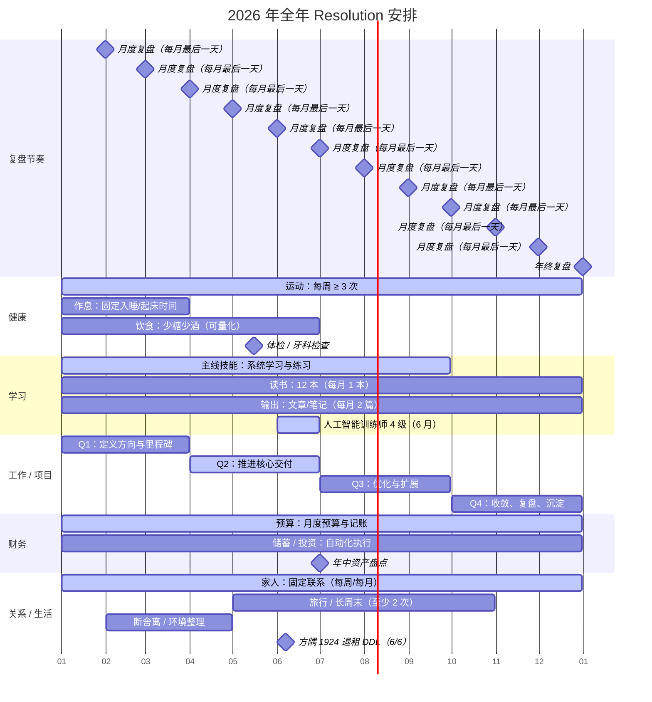

# 2026 年全年 Resolution 安排

## 年度目标（Resolution）
- 健康：
- 学习：
- 工作 / 项目：
- 财务：
- 关系 / 生活：

## 年度节奏（Mermaid）

## 月度执行清单（可选）
### 2026-01
- 本月最重要的 1 件事：
- 3 个关键行动：
- 量化指标：

### 2026-02
- 本月最重要的 1 件事：
- 3 个关键行动：
- 量化指标：

### 2026-03
- 本月最重要的 1 件事：
- 3 个关键行动：
- 量化指标：

### 2026-04
- 本月最重要的 1 件事：
- 3 个关键行动：
- 量化指标：

### 2026-05
- 本月最重要的 1 件事：
- 3 个关键行动：
- 量化指标：

### 2026-06
- 本月最重要的 1 件事：人工智能训练师 4 级
- 3 个关键行动：
  - 报名/资料/考试安排确认（含时间地点、费用、证件材料）
  - 每周固定学习与练习（刷题 + 实操 + 错题复盘）
  - 方隅 1924 退租流程推进（6/6 前完成提交与确认）
- 量化指标：完成并通过（或完成考试/评审）；6/6 前退租提交完成且对方确认

### 2026-07
- 本月最重要的 1 件事：
- 3 个关键行动：
- 量化指标：

### 2026-08
- 本月最重要的 1 件事：
- 3 个关键行动：
- 量化指标：

### 2026-09
- 本月最重要的 1 件事：
- 3 个关键行动：
- 量化指标：

### 2026-10
- 本月最重要的 1 件事：
- 3 个关键行动：
- 量化指标：

### 2026-11
- 本月最重要的 1 件事：
- 3 个关键行动：
- 量化指标：

### 2026-12
- 本月最重要的 1 件事：
- 3 个关键行动：
- 量化指标：
