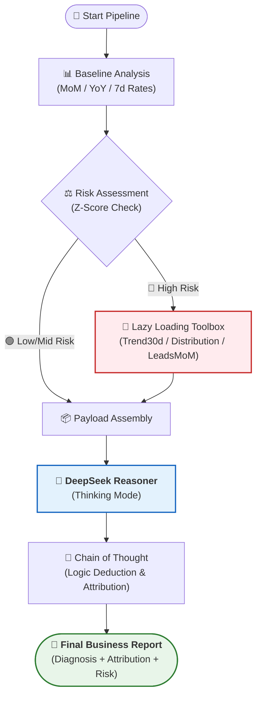
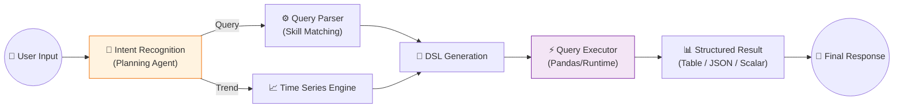
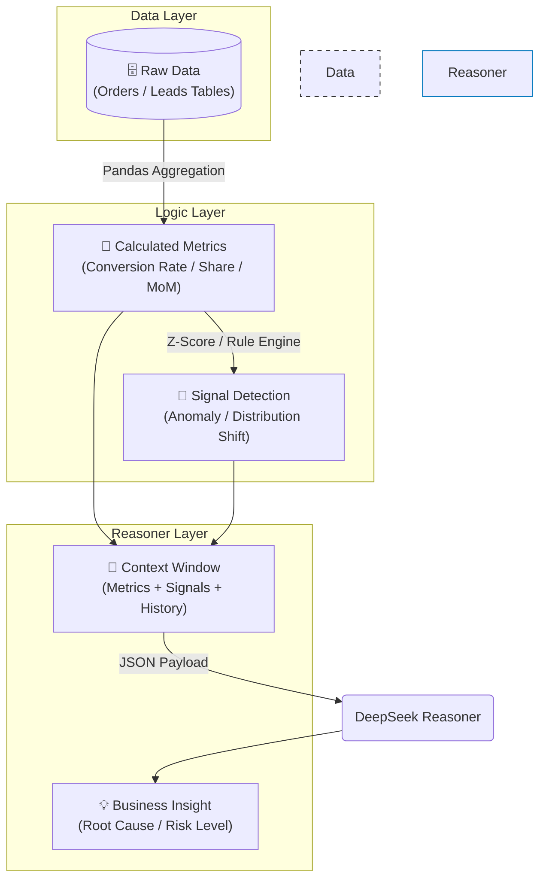

这个项目 **W52_reasoning** 是一个**基于 DeepSeek Reasoner (Thinking Mode) 的智能 BI 经营分析系统**。它将传统的指标计算与大模型的深度推理能力相结合，实现了从“数据报表”到“业务洞察”的跨越。

以下是为您整理的项目经验文档，包含工作流、数据流及核心技术亮点。

---

# 📘 W52_reasoning 项目经验文档

## 1. 项目概述 (Project Overview)

本项目旨在解决传统 BI 仅提供“数字”而缺乏“归因”的痛点。通过引入 **DeepSeek R1 (Reasoner)** 模型，系统不仅能实时回答复杂的交互式查询，还能每日自动巡检核心业务指标，在发现异常时自动触发深层归因诊断，输出高密度的业务简报。

---

## 2. 核心工作流 (Core Workflows)

### 2.1 每日经营分析流 (Daily Analysis Pipeline)

**场景**：每天凌晨自动运行，分析昨日锁单/销量表现，评估风险并归因。
**特点**：**<u>自动化、全链路、异常驱动</u>**。

### 2.2 交互式查询流 (Interactive Query Pipeline)

**场景**：用户通过自然语言提问（如“LS6 昨天在上海的销量”），系统实时解析并返回结果。
**特点**：**<u>模糊匹配、多维聚合、时间序列支持</u>**。

---

## 3. 数据流架构 (Data Flow Architecture)

数据在系统中的流转遵循 **“从原始宽表到高维信号”** 的提炼过程。

---

## 4. 关键技术亮点 (Key Technical Highlights)

### 4.1 <u>DeepSeek Thinking Mode 深度集成</u>

不同于传统 LLM 的“即问即答”，本项目利用 DeepSeek Reasoner 的 **Thinking Chain (思维链)** 能力。

- **高密度输出**：模型会自动过滤无效数据，仅在报告中呈现异常项（Checklist 模式）。
- **逻辑闭环**：通过 CoT（Chain of Thought），模型能自主推导“销量下滑”是由于“线索量不足”还是“转化率结构异常”，而非简单的罗列数据。

### 4.2 <u>Configuration-Driven Strategy (配置驱动策略)</u>

系统的智能不是写死在代码里的，而是定义在 YAML 配置文件中。

- **`planning_skills.yaml`**：定义了用户的意图分类（如 `status_check`, `trend_analysis`）及其对应的分析策略。
- **`query_skills.yaml`**：集中管理指标别名（如“锁单”->`lock_order`）和维度映射，实现了**<u>业务逻辑与代码解耦</u>**。

### 4.3 <u>Lazy Loading Diagnosis (按需加载诊断)</u>

为节省 Token 并提高效率，系统实现了**条件触发式诊断**。

- **Level 0**: 仅进行基础指标扫描（低成本）。
- **Level 1 Trigger**: 仅当 Risk > High 时，动态加载 `Toolbox`（高成本，含 30 天趋势、分布定位）。
- **Level 2 Trigger**: 若发现线索剧烈波动，进一步追加周同比（WoW）分析。
  这种机制确保了 **“好钢用在刀刃上”**。

### 4.4 <u>Robust Interactive Query (鲁棒的交互式查询)</u>

- **模糊匹配**：支持 `store_city contains '上海'` 这种非精确匹配，适应用户口语化输入。
- **时间序列感知**：能自动识别“2025 年每个月”这样的时间跨度，并调用 Time Series 接口返回序列数据而非单点数据。
- **多维聚合**：支持 `Group By` 操作，例如“分车系看销量”，并自动格式化为 Markdown 表格展示。

---

### 5. 总结

W52_reasoning 项目展示了 **BI + AI Agent** 的最佳实践：底层利用 **<u>Pandas 高效计算</u>** 保证数据准确性，顶层利用 **<u>DeepSeek Reasoner 逻辑推理</u>** 提供业务解释力，中间层通过 **<u>配置化 Agent</u>** 实现灵活调度。
