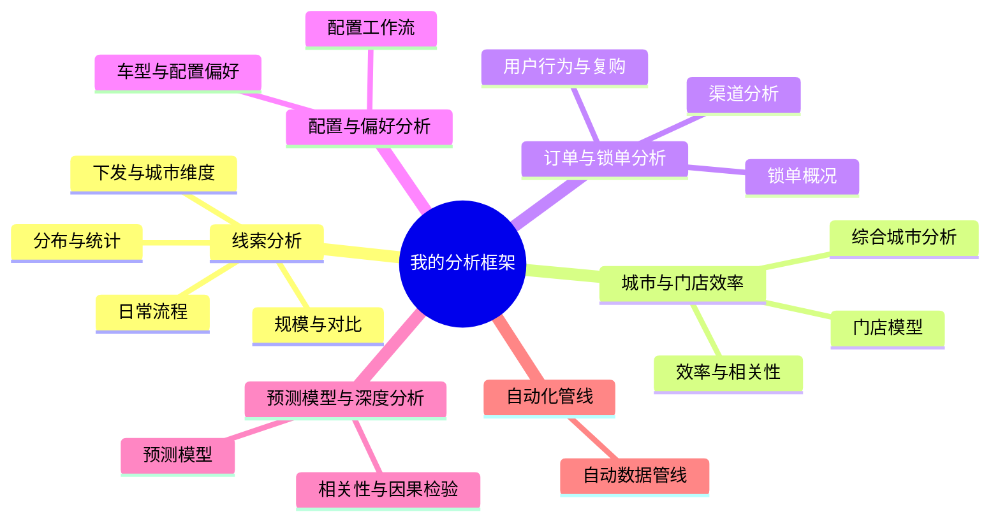

# 我的分析框架

## 1. 线索分析 (Leads Analysis)

### 分布与统计

- **正态性检验与描述性统计**
  - 样本量 N=322, 均值=17333.5, 标准差=7015.7, 偏度=0.98, 峰度=1.56 (肥尾分布)
  ```bash
  python scripts/analyze_plot_leads_normality.py --start 2025-01-01 --end 2025-11-18
  ```

### 规模与对比

- **分渠道线索数 / 线索量规模对比**
  ```bash
  python scripts/analyze_plot_leads_aggregated_comparison.py --start1 2025-08-15 --end1 2025-09-10 --start2 2025-11-04 --end2 2025-11-12
  ```

### 日常流程

- **线索日报工作流**
  - 输出：`processed/leads_daily_XXX` 的最新 csv文件
  ```bash
  python scripts/leads_daily_workflow.py --verbose
  ```

### 下发与城市维度

- **分城市下发线索数**
  - 输出：`original/leads_assign_city_store2_1.csv`
  ```bash
  python scripts/leads_assign_summary.py --start "2025-11-12" --end "2025-11-23"
  ```
- **线索表导出**
  ```bash
  python scripts/leads_table_export_city.py
  ```

## 2. 城市与门店效率 (City & Store Efficiency)

### 综合城市分析

- **指标**：有效线索数、下发线索/有效线索比值、下发线索/订单比值、前后效率差异
- **单时间段** (保持不变，输出Markdown):
  ```bash
  python scripts/comprehensive_city_analysis.py --start 2025-11-12 --end 2025-11-16
  ```
- **双时间段对比** (输出CSV):
  ```bash
  python scripts/comprehensive_city_analysis.py --start 2025-09-10 --end 2025-09-14 --start2 2025-11-12 --end2 2025-11-16
  ```
- **效率阈值分析**
  - 设置阈值：线索识别数 >= 500
  ```bash
  python scripts/comprehensive_city_analysis.py --start 2025-11-12 --end 2025-11-23
  ```

### 效率与相关性

- **分城市、分门店订单数与EV相关性**
  ```bash
  python scripts/city_efficiency_ev_correlation.py \
    --nov_md processed/analysis_results/comprehensive_city_analysis_2025-11-12_to_2025-11-18.md \
    --sep_md processed/analysis_results/comprehensive_city_analysis_2025-09-10_to_2025-09-16.md \
    --ev_csv processed/analysis_results/cm2_city_range_ev_counts.csv \
    --min_leads 1000 \
    --out_md processed/analysis_results/city_efficiency_ev_correlation_2025-09_vs_11_min1000_excl_lhasa.md \
    --pairs_output processed/analysis_results/city_efficiency_ev_pairs_2025-09_vs_11_min1000_excl_lhasa.csv \
    --plot_output reports/city_efficiency_vs_ev_ratio_scatter_min1000_excl_lhasa.html \
    --label_top 10 --label_small_top 5 --label_mode diff_abs
  ```

### 门店模型

- **单店模型（门店概况）**
  ```bash
  python store_analysis.py
  ```

## 3. 订单与锁单分析 (Order & Lock Analysis)

### 锁单概况

- **分城市锁单数**
  ```bash
  python scripts/intention_lock_summary.py --start 2025-11-12 --end 2025-11-17
  ```
- **锁单基本汇总**
  ```bash
  python scripts/lock_summary.py --start 2025-11-12 --end 2025-11-17
  ```
- **指定车型锁单**
  ```bash
  python3 /Users/zihao_/Documents/coding/dataset/scripts/lock_summary.py --start 2025-11-12 --end 2025-12-09 --models "LS9,CM2,CM2 增程"
  ```
- **全年锁单（增长视角）**
  - Pearson r = 0.4990, Spearman rho = 0.6385, N = 44
  ```bash
  source venv/bin/activate && python scripts/analyze_plot_lock_cumulative_ratio_2025.py
  ```

### 渠道分析

- **分渠道订单数**
  - 数据源：`formatted/intention_order_analysis.parquet`
- **分渠道订单占比**
  ```bash
  python scripts/analyze_plot_channel_share_comparison.py --start1 2025-09-10 --end1 2025-09-15 --start2 2025-11-12 --end2 2025-11-17
  ```

### 用户行为与复购

- **复购用户判断**
  ```bash
  python skills/repeat_buyer_analysis.py --vehicle-type LS9 --lock-start-date 2025-11-12 --lock-end-date 2025-11-25
  ```
- **锁单行为深度（时间间隔）**
  ```bash
  python skills/lock_depth_analysis.py
  ```

## 4. 配置与偏好分析 (Configuration & Preference)

### 车型与配置偏好

- **分城市车型偏好 (纯电偏好度)**
  - 筛选：车型分组 = CM2；Lock_Time ∈ [2025-09-10, 2025-10-15]
  - 输出：`../processed/analysis_results/product_types_preference_by_city.csv`
  ```bash
  python scripts/analyze_product_types_preference_by_city.py
  ```
- **人群偏好差异 / 用户-配置规则 (Apriori)**
  - 输出：`processed/analysis_results/LS9_user_to_config_association_rules.csv`
  ```bash
  python scripts/analyze_user_to_config_rules.py
  ```

### 配置工作流

- **配置表处理**
  - 输入：`processed/CM2_Configuration_Details_*.csv`
  - 输出示例：
    - `original/LS9_Configuration_Details_20251118_100031.csv`
    - `processed/LS9_Configuration_Details_transposed_20251118_100031.csv`
  ```bash
  python scripts/configuration_workflow.py --verbose
  # 指定车型
  python scripts/configuration_workflow.py --model LS9
  ```

## 5. 预测模型与深度分析 (Prediction & Advanced Analysis)

### 相关性与因果检验

- **小订与上市后锁单相关性分析**
  ```bash
  python skills/cycle_conversion_correlation.py
  ```
- **Granger 因果检验（小订→锁单）**
  ```bash
  python skills/granger_subscription_lock_daily.py
  ```

### 预测模型

- **小订预测（经验+Boosting双峰混合）**
  ```bash
  python scripts/intention_order_predict_mixed.py
  ```
- **转化率预测 / 趋势分析**
  - XGBoost AUC 0.72
  ```bash
  python scripts/intention_order_binary_model.py
  ```
- **价格敏感度分析 (XGBoost)**
  - (命令未明确，归类于此)

## 6. 自动化管线 (Automation)

- **自动数据管线**
  ```bash
  source venv/bin/activate && python scripts/automated_data_pipeline.py --flomo
  ```

## 7. 思维导图总结



## 数据科学框架

1. **Apriori** (关联规则挖掘算法)
2. **XGBoost** (梯度提升决策树框架)
3. **Boosting** (集成学习算法统称，这里指代一种策略)
4. **Granger** (格兰杰因果检验，统计学方法)
5. **Pearson / Spearman** (相关系数，统计学指标)
