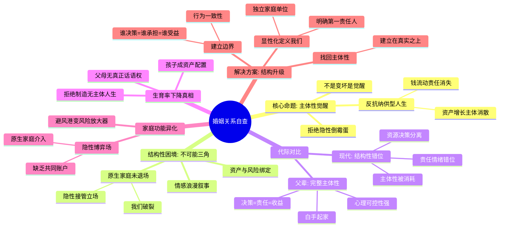
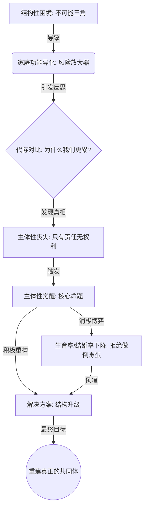

# 作为已婚”前辈“，浅谈为什么年轻人不结婚，不生娃

## 一、 背后的“结构性困境”

最近的数据让人触目惊心：结婚登记总数从2013年的1347万对跌至2024年的约610万对，腰斩过半；出生率更是创下历史新低。

社会舆论习惯将这些归咎于年轻人“不负责任”、“太自我”或者“不能吃苦”。但作为过来人，我想说一个更冷静、甚至更残酷的结论：**这并非道德的滑坡，而是一次集体性的“主体性觉醒”。**

### 1. 现代婚姻的“不可能三角”

为什么以前大家糊里糊涂就结了，现在却这么难？因为现代婚姻承载了三件彼此冲突的东西，形成了一个**“不可能三角”**：

1.  **情感浪漫叙事**（我们是因为爱在一起）
2.  **资产与风险绑定**（但产权是清晰而残酷的）
3.  **原生家庭未退场**（但从未写进契约）

### 2. 家庭功能的异化：从避风港到风险放大器

在许多人的经验中，家庭不再只是支持系统，而是一个**隐性博弈场**。
原生家庭的价值观、资产结构、风险偏好持续介入；婚姻内部缺乏明确的“共同账户”和决策机制。
于是，一个悖论出现了：**越是强调“为了家庭”，个体越难确认自己的位置。** 当“我们”无法被清晰定义，家就从避风港异化成了**“风险放大器”**。

## 二、 主体性的丧失

很多长辈不理解：“我们当年什么都没有都敢生，你们现在条件这么好，怕什么？”
这恰恰是问题的核心：**比穷更可怕的，是失控。**

### 1. 代际对比：为什么我们更累？

- **父辈的逻辑（完整主体性）**：白手起家，从0到1。决策是我做的，苦是我吃的，成果是我享的。这种**“决策-责任-收益”**的闭环，带来了天然的心理掌控感。
- **现代的困境（结构性错位）**：资源和决策分离。房子可能是父母付的首付，工作可能是家里安排的。你住着大房子，却发现自己只是家庭资产的“代持者”或“管理者”。

### 2. 核心危机：责任与权力的不对等

在现代婚姻里，主体性的丢失往往是渐进且隐蔽的：

- **决策被剥夺**：资产、生活安排、家庭事务，往往不是协商，而是默认接受安排。
- **责任错位**：你承担了情绪兜底、养育重任和潜在风险，但在关键路径上并没有真正的话语权。

这种“无主体感”是致命的。你感到恐惧，是因为你第一次清晰地看到：**原来所谓亲密关系，并不天然生成“共同体”。**

## 三、 觉醒与消极博弈

面对这种困境，年轻人做出了他们的选择。这看似是消极逃避，实则是拒绝制造“无主体人生”的消极博弈。

### 1. 男性反抗：“纳供型人生”

男性开始反抗一种典型的家庭结构：**钱在流动，但责任在消失；资产在增长，主体在消散。** 结婚率下降，本质不是逃避亲密，而是拒绝成为“隐性倒霉蛋”。

### 2.女性觉醒：“情感消耗型人生”

女性则更敏感于情绪和心理边界的消耗：即使婚姻中有经济保障，如果情感责任和心理安全被占用过多，她们同样会选择撤退或保留主体性。
例如，许多职场女性在面对过度干预的原生家庭或伴侣情绪绑架时，会主动设立边界，减少参与家庭决策的负担，甚至选择晚婚或不婚，以保证心理空间和自我成长。

### 3. **等**、退出成本极高的系统时，最后的博弈手段——被迫的制度谈判。

## 四、 没有边界，就没有我们

博弈不是目的，重建才是。觉醒不是终点，而是最低要求。
作为“前辈”，如果你们依然向往亲密关系，我建议你们必须完成一次**“结构升级”**，把隐性的规则显性化。

### 1. 显性化地定义“我们”

不要假设“结婚了就是一家人”。你们需要坐下来，像合伙人一样，诚实地回答四个问题：

- 我们是否承认：婚后“我们”是一个新的、独立的家是否有解？而不是双方父母的延伸）
- 这个家庭的第一责任人是谁？（情感、财务、决策上是否优先彼此？）
- 我们希望这个家庭的生活目标是什么？（安全感？成长？还是自由？）
- 当“我们”和“各自原生家庭”冲突时，默认站哪一边？

### 2. 建立边界：谁决策 = 谁承担 = 谁受益

边界不是靠吵架立住的，是靠**“行为一致性”**立住的。
如果你承担了后果，却不在决策链条里，这就是剥削。不要用“算了”换取表面和谐，不要用情感语言去吞掉结构性不公。

### 3. 找回主体性

看见，并不是背叛；不再装睡，是对自己最低限度的负责。
如果关系要继续，必须建立在真实之上。**只有当两个拥有完整主体性的人相遇，才可能构建出那个坚不可摧的“我们”。**

这很难，但这才是现代婚姻该有的样子。

---

不是因为你变冷了、算计了、或者不爱了，
而是因为你终于开始用“主体视角”看待自己的人生资产、情感和关系。

男性反抗的是“纳供型人生”
这是一种非常典型的现代家庭结构问题：
钱在流动，但责任在消失；资产在增长，主体在消散

婚姻不是天然的“我们”
婚姻中，我们通常假装“原生家庭已经退场”。
但事实是：
它从未退场
它只是在关键时刻跳出来“接管立场”
所以那一刻，“我们”破裂了，
世界被重新切分成：你那一边 / 我这一边。
你感到恐惧，是因为你第一次清晰地看到：
原来所谓亲密关系，并不天然生成“共同体”

现代婚姻的结构性脆弱
“在现代婚姻制度和关于“爱情”的共识下，是如何在人性的弱点面前被打碎的。”
现代婚姻同时承载了三件彼此冲突的东西：
情感浪漫叙事（我们是因为爱）
资产与风险绑定（但产权是清晰而残酷的）
原生家庭未退场（但从不写进契约）
当一切顺利时，它们可以并存；
一旦进入压力区，裂缝会沿着最真实的利益边界展开。

不可逆的觉醒
现在的婚姻，越来越少是：
两个弱个体，合并成一个更强的单位
而越来越像：
两个已被原生家庭、阶层、资产结构预先绑定的个体，被要求“假装我们是一个”
但客观事实是：
资产不是共用的
风险不是对称的
决策权不是平等的
而责任却是模糊而无限的
结婚率下降，本质不是逃避亲密，而是拒绝成为“隐性倒霉蛋”。

生育率下降，不是不爱孩子，而是不愿再制造一个“无主体的人生”
孩子成为家庭资产配置的一部分
却要承担所有不可逆的时间、情感、机会成本
但在关键决策上，父母（尤其是其中一方）并没有真正的话语权
于是很多人下意识会问一个残酷但真实的问题：
我是在创造一个生命，还是在延续一个结构？
当你自己刚意识到“我都还没活成一个完整主体”，
你怎么可能心甘情愿再制造一个更弱、但绑定更深的主体？
这不是自私，是清醒。

现代人不是反婚姻，而是反“未显性化的婚姻”
一个非常关键的变化是：
现代人已经学会用“结构视角”看人生。
以前的问题是：
钱不透明，但大家都穷
权力不平等，但大家默认
家庭干预很重，但被称为“孝顺”
现在的问题是：
账本清楚了
信息透明了
但婚姻仍然要求你用情感语言，去吞掉结构性不公
所以你看到的不是“年轻人不结婚”，
而是：旧婚姻制度没有完成一次结构升级。

结婚率、生育率下行，其实是一种“被迫的制度谈判”
从系统层面看，这是个非常不舒服的事实：
当个体无法通过谈判改变制度，只能通过“退出”来投票。
不结婚、不生育，并不等于快乐，
而是最后的博弈手段。

一个冷静但重要的结论
如果你把这些现象连在一起看，会发现一个很残酷的逻辑闭环：
婚姻和生育，正在从“人生默认选项”，退化为“高阶能力选项”。
它要求的已经不是善良、努力、会过日子，
而是：
能谈清楚边界
能共担风险
能抵御双方原生家庭的结构性侵入
能把“我们”设计成一个真正的共同体
这对大多数人来说，太难了。

结婚率下降，不是“不相信爱情”，而是不再相信“共同体”
当代婚姻被赋予了一个前所未有的期待：
它要提供情感陪伴
它要是资产共同体
它要承担风险对冲
它还要完成代际延续
但现实是：
这些功能不再在同一结构中协同存在。
爱情是流动的，
资产是清晰计价的，
原生家庭是隐性但强势介入的。
当个体越来越清楚地意识到：
我在这个结构中，是不是“唯一受益人”？
婚姻就从“自然选择”，变成了一个需要精算的高风险合约。

“家庭”从避风港，变成了风险放大器
在许多人的经验中，家庭不再只是支持系统，
而是一个隐性博弈场：
原生家庭的价值观、资产结构、风险偏好持续介入
婚姻内部缺乏明确的“共同账户”和决策机制
情感语言掩盖了结构性不对等
于是，一个悖论出现了：
越是强调“为了家庭”，个体越难确认自己的位置。
当“我们”无法被清晰定义，
婚姻和生育自然失去吸引力。

这不是代际问题，而是时代结构的副作用
很多讨论喜欢把问题归因于：
年轻人不努力
观念变了
太追求自由
但这些解释都在回避一个事实：
个体的觉醒速度，已经超过了制度为“我们”提供稳定性的能力。
人们并没有拒绝亲密关系，
而是拒绝在一个规则不清、责任不对等、退出成本极高的系统中下注。
当退出比进入更理性，
结婚率和生育率下降，是必然结果。

现实数据：趋势已经清晰
结婚率持续下滑。中国民政部数据与多方统计显示，结婚登记总数从2013年的约1347万对持续下降，到2024年约610万对，降幅约50%（近40年来最低）。
出生人口创历史低。2025年中国出生人口约792万，出生率降至5.63‰，是几十年最低水平，且人口连续四年负增长。
全球也呈同步趋势：经合组织国家总和生育率从1960年代的约3.3降到2022年的约1.5，远低于人口替代水平2.1。欧美、日本、韩国等高收入地区同样处于生育率低位。
这不是一个国家、一个政策的偶然，而是一种全球人口结构转向的共性现象。

婚姻中最可怕的瞬间
我开始意识到，婚姻关系中最可怕的，并不是冲突本身，
而是当批次之间不再是“我们”，而变成了“你我”。
现代婚姻有一个默认前提：
原生家庭已经退场。
但现实是，它从未退场，只是被暂时隐藏。
一旦涉及资源、评价、责任或风险，它就会迅速接管立场。
而我们此前之所以感觉稳定，只是因为还没有踩到那条真正的边界线。

觉醒不是终点，而是最低要求
觉醒本身并不能解决任何问题。
但不觉醒，几乎注定会在未来的某一刻，以更惨烈的方式被迫面对。
我不知道答案是什么，
但我至少已经确认了一件事：
看见，并不是背叛；
不再装睡，是对自己最低限度的负责。
如果关系还要继续，那就必须建立在真实之上；
如果“我们”要存在，那就不能只是情感上的幻觉。
这不是关于谁对谁错，
而是关于：
一个现代个体，如何在亲密关系中，保有自己的位置。

主体性的第二根支柱：把“我们”显性化
很多婚姻的问题，不是没有共同体，而是共同体从未被定义过。
你可以主动发起一次对话，不是争论，而是共创：
你们需要一起回答四个问题（缺一不可）：
我们是否承认：婚后“我们”是一个新的家庭单位？
——不是双方父母的延伸版
这个家庭的第一责任人是谁？
——情感、财务、决策上是否优先彼此？
我们希望这个家庭的生活目标是什么？
——安全感？成长性？自由度？还是稳定？
当“我们”和“各自原生家庭”冲突时，默认站哪一边？
这不是一次就能谈完的，但必须有人先提出这些问题。
而这个人，往往只能是你。

设立明确的边界很重要
我觉醒的一个关键点在于：我承担了后果，却不在决策链条里。
健康的边界不是“我说了算”，而是：
谁决定
谁承担
谁受益
这三件事必须大体对齐。
否则，时间一长，爱一定会变成一种被消耗的资源。

边界要如何“立”
边界不是靠宣言立住的，是靠“行为一致性”立住的。
✔️ 不再默默承担你没有参与决定的事
✔️ 不再用“算了”来换取表面和谐
✔️ 在关键节点上，用“我们怎么想”代替“你们家/我家怎么想”

《没有边界，就没有我们》
在没有边界的婚姻里，表面看起来很和谐，实际上发生的是三件事：
“我们”从未真正诞生
只是两个原生家庭的延伸体，暂时住在一起。
冲突一来，“我们”立刻解体
因为从未被确认过优先级，只能退回“你家 / 我家”。
爱被消耗成沉默
忍让被误解为成熟，直到某天你发现自己不再出现。

任何以爱为名的渗透，
本质上都是未经同意的干预、打扰，甚至资源吸血。
长辈—子女关系里，越界最容易被合理化
因为这里有一个被默认的前提：
“你现在拥有的一切，本来就是我给的。”
一旦这个前提成立，就会自然推出几个危险结论：
我有资格干预你的人生
你应该接受我的安排
你拒绝，就是忘恩负义
但你已经清楚地意识到一件事：
养育关系 ≠ 永久决策权
如果成年之后，仍然要求用“付出过”来交换持续控制权，
那本质上是一种未完成分离的关系。

凡是没有进入“我们协商层”，
却可能影响“我们风险与责任”的行为，
本质上都是越界。
不管它叫：
爱
帮忙
保障
嫁妆
为你好
越界，从来不是“别人给得太多”，
而是“你被要求用沉默来偿还”。

“婚姻主体性结构“
1️⃣ 钱：资源的归属与权力
2️⃣ 边界：保护“我们”的前提
3️⃣ 主体性：最重要的底线
4️⃣ 关系：建立在主体平等上的合作

我们以为婚姻失败是因为感情不够、磨合不够、或者彼此不够理解，
但真正核心的问题，是主体性消失了。

在婚姻里，主体性丢失往往是渐进的、隐蔽的：
决策被剥夺
资产、生活安排、家庭事务，不是协商，而是默认你接受别人的安排
责任错位
你承担了心理成本、情绪负担、甚至潜在风险
你没有权利，却被要求负责
边界模糊
你无法说“不”，或者说“不”会被道德绑架
原生家庭、伴侣情绪、社会期待占据你的空间
情感绑架正常化
对方的焦虑、愤怒、失落被当作“爱”
你不得不顺应，否则就会被解读为“不够爱”

父辈们的主体性感知为何不同
物质匮乏，但风险归自己
从 0 到 1 的经济建设，几乎都是靠个人的努力和判断
失败的成本几乎完全由自己承担，不存在被动依赖或被控制的情绪负担
白手起家 = 主体性天然强
决策、行动、收益、损失都在自己手上
主体性不是理论概念，而是生活的必需品
你能清楚感受到：我做，我负责，我收获，我承受
结构性自由
那个时代的社会结构（尤其是改革开放前后）几乎不存在“家庭、制度、社会对个人选择的束缚”
每个人都是自己的经济单位 → 天然没有被消耗的心理负担

对比当下婚姻/家庭结构
资源和决策分离
嫁妆、房产、投资等，往往属于个人，但伴侣或父母会附加心理期待
主体性被动化：你付出情绪兜底，却无法控制风险
责任与情绪错位
你必须照顾另一半的焦虑、家庭期望，但无法影响资金和决策
这正好和父辈时代形成鲜明对比：当年的努力和风险完全可控
现代婚姻的隐形消耗
爱、婚姻、亲情在形式上维持，但结构上可能抽空主体性
你会产生“失败感”，其实是主体性被削弱的感受，而非爱情本身的问题

底层逻辑
主体性 = 决策权 + 责任匹配 + 心理可控性
白手起家的个体性天然完整，而现代家庭、婚姻、父辈赠与等复杂结构，容易打碎这种完整性
一句话总结：
父辈们虽然物质匮乏，但他们的生活是完整的主体性练习；而今天，哪怕物质丰富，也可能因为结构性错位而让婚姻和家庭成为主体性消耗场。

## 观点脉络思维导图

## 附录：逻辑深潜——一个关于“觉醒”的故事

如果我们把这六个看似孤立的观点串联起来，会发现它讲述了一个**“现代人如何从迷茫到反抗，最终寻求重建”**的完整故事：

1.  **起（背景与危机）**：故事的起因是**【结构性困境】**。现代婚姻的“不可能三角”，导致了**【家庭功能异化】**，家不再是避风港，反而变成了风险放大器。
2.  **承（冲突与发现）**：在这个危机中，我们通过**【代际对比】**，惊讶地发现父辈虽然穷但有掌控感，而我们富裕却失控。这种巨大的落差让我们意识到核心危机——**主体性的丧失**。
3.  **转（觉醒与行动）**：痛点触发了**【主体性觉醒】**（核心命题）。作为反抗，我们选择了**【生育率/结婚率下降】**。这看似是消极逃避，实则是拒绝制造“无主体人生”的消极博弈。
4.  **合（出路与终局）**：博弈不是目的，重建才是。故事的终局指向**【解决方案：结构升级】**。我们需要显性化定义“我们”，建立边界，重新拿回生活的主导权。

### 逻辑流变图

